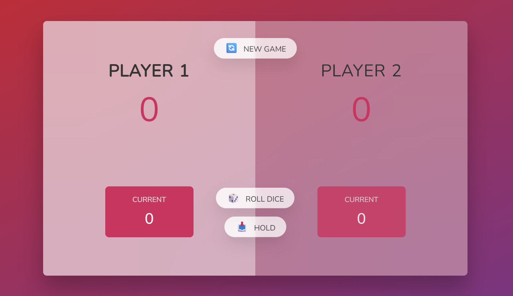

# Pig Dice Game

This project is a web-based implementation of the classic dice game Pig, developed using HTML, CSS, and vanilla JavaScript. The game provides a fun and interactive way to enjoy the traditional game with a modern twist.

### 🌐 Live Demo: [Pig Dice Game](https://pig-dice-game-mz.vercel.app/)

## Screenshot

## How to Play

1. Objective: The goal of the game is to be the first player to reach a total score of 100 points.
2. Turns: Two players take turns rolling a single die.
3. Scoring:
   Each roll adds the rolled value to the current turn's total.
   Players can choose to "Hold," which adds the turn total to their overall score and passes the turn to the other player.
   Rolling a 1 ends the player's turn immediately, and the turn total is forfeited.
4. Winning: The game declares a winner once a player reaches a total score of 100 points.

## Features

- Interactive UI: Smooth and user-friendly interface for an engaging user experience.
- Real-time Score Update: Scores are updated in real-time to reflect the current state of the game.
- Dynamic Turn Switching: Automatic turn switching to ensure seamless gameplay.

## Flowchart

